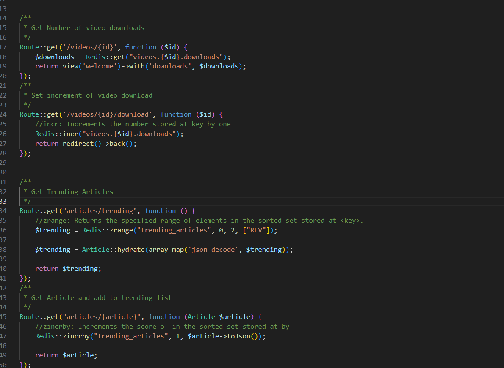

# Load Balance a Laravel App

<p align="center">🚀This application is an usage example of using Redis with laravel</p>
Usage examples: Number of video downloads, Trending Articles, User Stats. Examples are in the web.php file.


## Available Scripts

### Steps.

```bash
#Run Docker
    docker-compose up -d
#rename .env.example to .env and check the parameters
    set Laravel .env
#Run migrate
    docker-compose run  --rm artisan migrate

```


